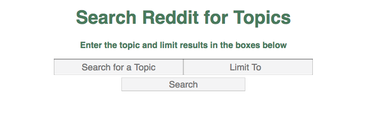
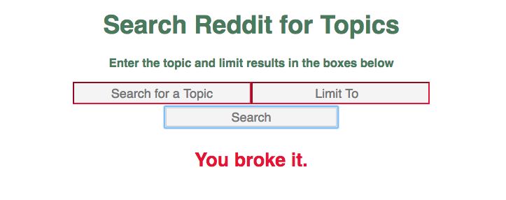

# Forms and Props

This is an application that allows a user to enter in a topic and limit search results in a form and returns a list of results as links.

### Home Screen:



### Search Results:


If an entry is invalid, the input border changes to red and an error message is displayed.

### Error Screen:




---

## Installing and Getting Started

To install, fork and git clone this repository to your local computer. Navigate to the `lab-melanie` directory in your terminal and type `npm i` to install all necessary dependencies. Be sure the `package.json` file includes the scripts:
```json
"scripts": {
    "build": "webpack",
    "watch": "webpack-dev-server --inline --hot"
}
```
Type `npm run watch` in the command line, then in your browser, go to `localhost:8080` and enjoy!
